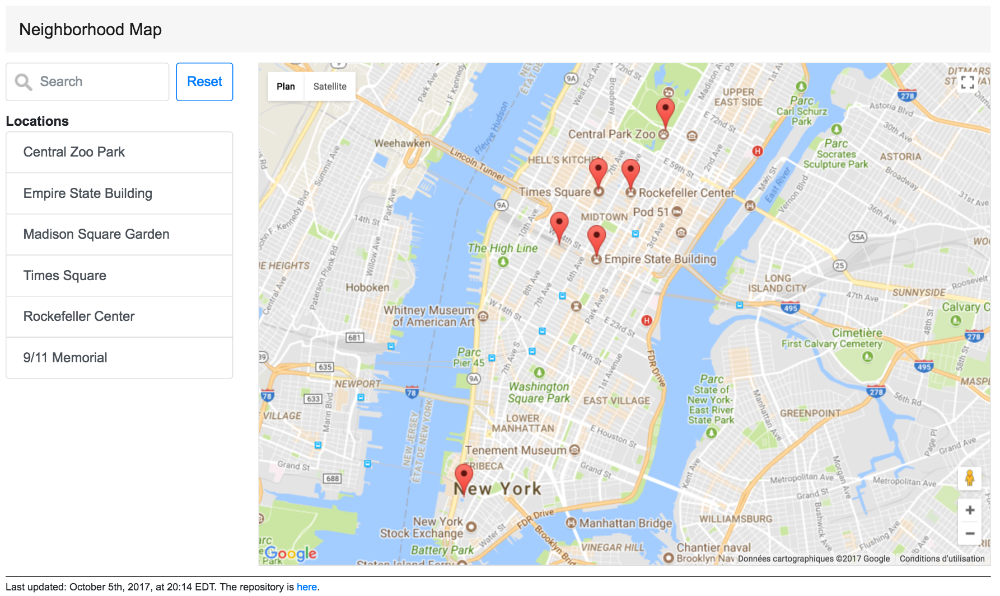
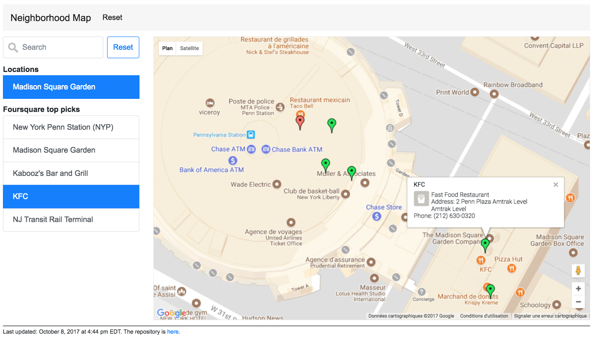

# Neighborhood map

Udacity project with [Knockout.js](http://knockoutjs.com/), [Google Maps API](https://developers.google.com/maps/) and [Foursquare API](https://developer.foursquare.com/docs).

## Setup

Clone or download this [repository](https://github.com/boisalai/neighborhood-map) 
and run index.html file in browser.

## Some functionalities

- Google map loaded from Maps API.
- Six locations in New York City.
- Location filter that uses an input field to filter both the list view and the map markers displayed. 
- Location list view and the markers updated accordingly in real time.
- Five Foursquare top picks near selected location displayed in a list view and as green map markers. 
- Reset button to re-initialize page.
- Warning message if trouble loading Google Maps.
- Mobile responsive.

[2017-10-05] JavaScript code checked for syntax errors with [JSHint](http://jshint.com/).

[2017-10-08] Required changes after the reviewer's suggestions.
- Clicking on marker show nearby Foursquare places. Now, clicking on marker have the same effect as when a location list item is clicked.
- To show or hide markers, I use `someMarker.setVisible(true); // or false`.
- Data manipulation of the DOM always uses Knockout (MVVM pattern), not jQuery nor Javascript DOM methods.
- Manipulation of the layout/aesthetic components now uses Knockout (MVVM pattern) with css binding.
- Error handling method for Ajax request by adding fail method.
- Google Map is now provided with a fallback error handling method.

## License

The contents of this repository are covered under the [MIT License](LICENSE).

